# AccountingSoftware
######
Accounting Software final project for QA's bootcamp by Tom

## Introduction
This is a backend spring boot application which could enable the frontend of a company accounting web service to access a MySQL database. It has full CRUD capability for both an Employee and a Departments table within the database. Using this application would make it easier to track and store the financial obligations of a company. This readme provides a comprehensive overview of the application's functionality, as well as evidence of testing and an explanation of how to run the app.

## Functionality
* Creating new departments.
* Updating existing departments.
* Viewing a single department by its ID.
* Viewing every department.
* Creating new employees.
* Updating existing employees.
* Viewing a single employee by their ID.
* Viewing every employee.

## Tools used
In order to create this project, various tools were necessary for my success:
* The STS IDE made managing imports, debugging my code and refactoring substantially easier.
* Maven enabled me to manage the many dependancies of my application much more expediently than if I had tried to manage them individually.
* In particular, amongst those dependencies JUnit enabled me to unit test my application meaning I didn't have to finish the entire application before checking if individual components were functional.
* MySQL workbench allowed me to manage my local MySQL instance as well and make sure that the application I made actually functioned on the database.
* Postman then allowed me to test the functionality of my backend without requiring a full prexisting frontend.

## Project structure
Illustrated below is the file structure of the project:

	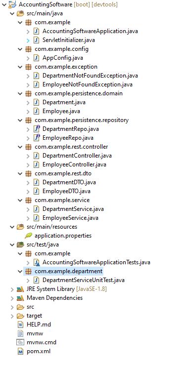

 

## Entity Relationships
Illustrated below is an ERD depicting the relationship between the entities in this project.

	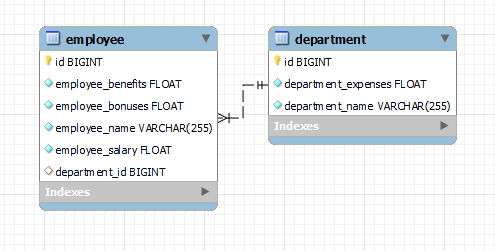

 

## Application Overview
Illustrated below are examples of the program running and performing various actions.

	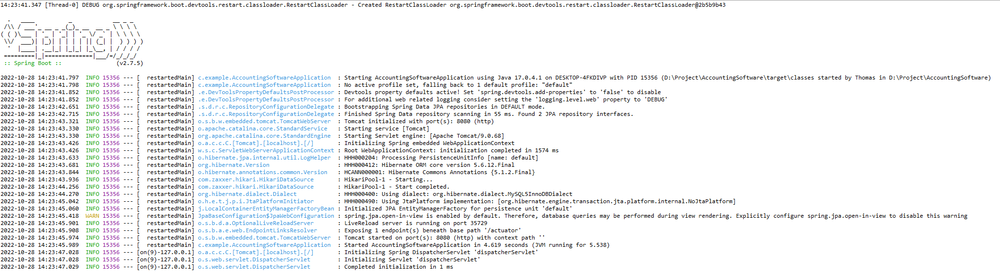

 

	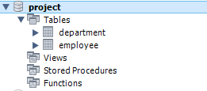

	

 

	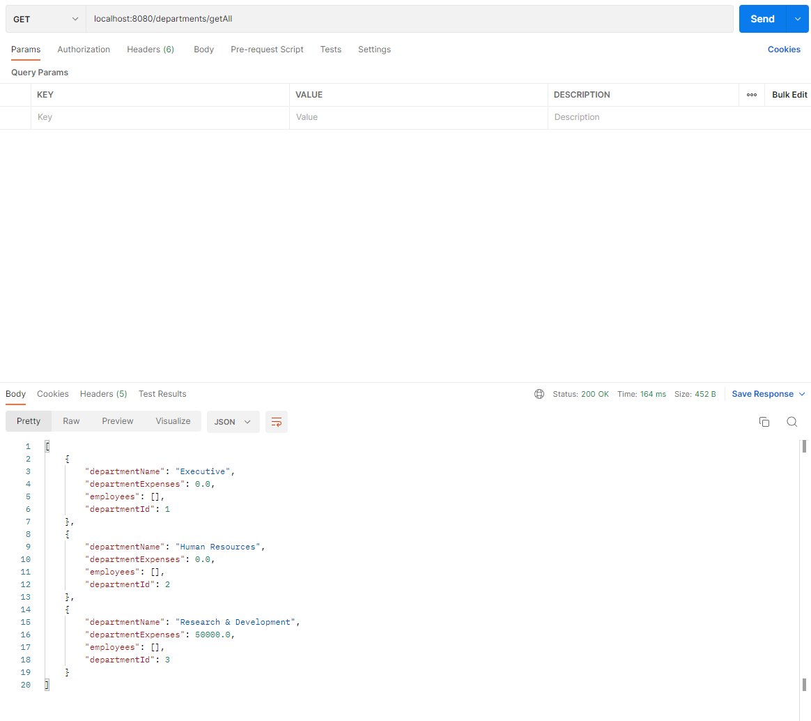

 

	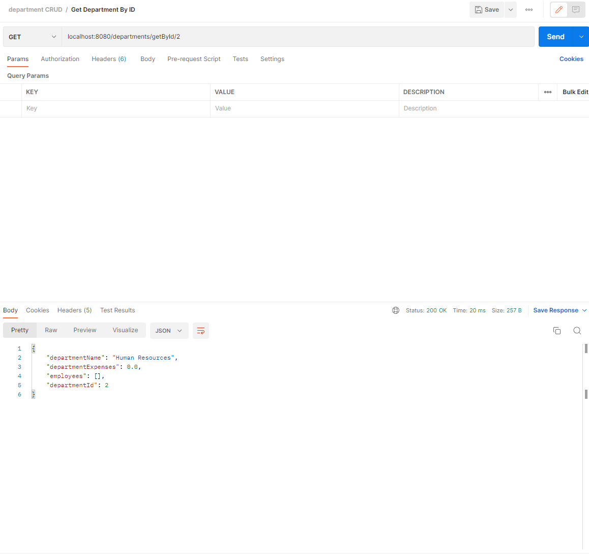

 

	

 

	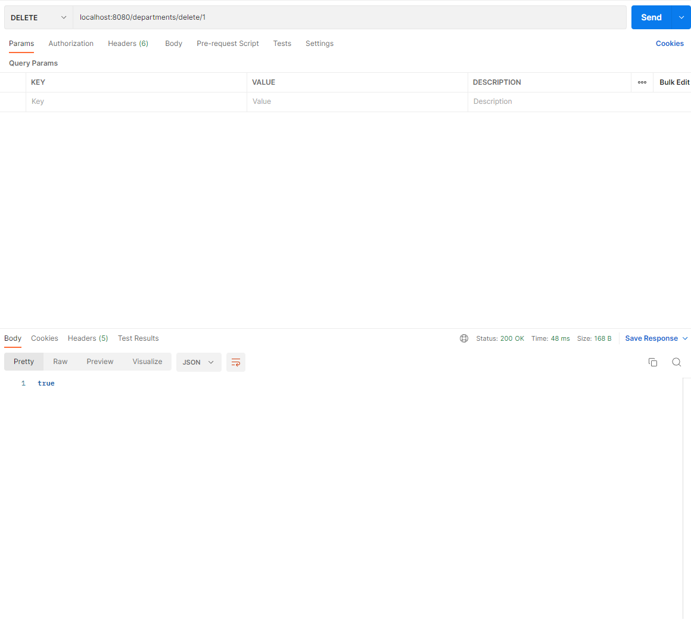

 

	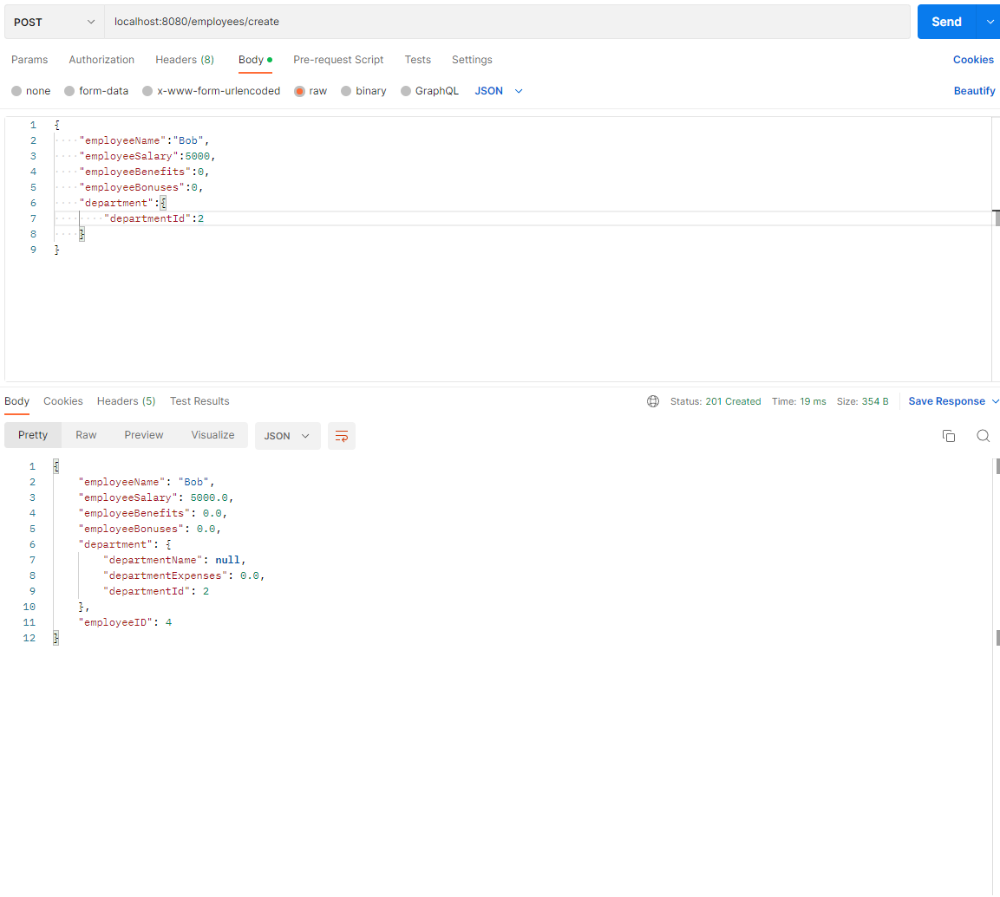

 

	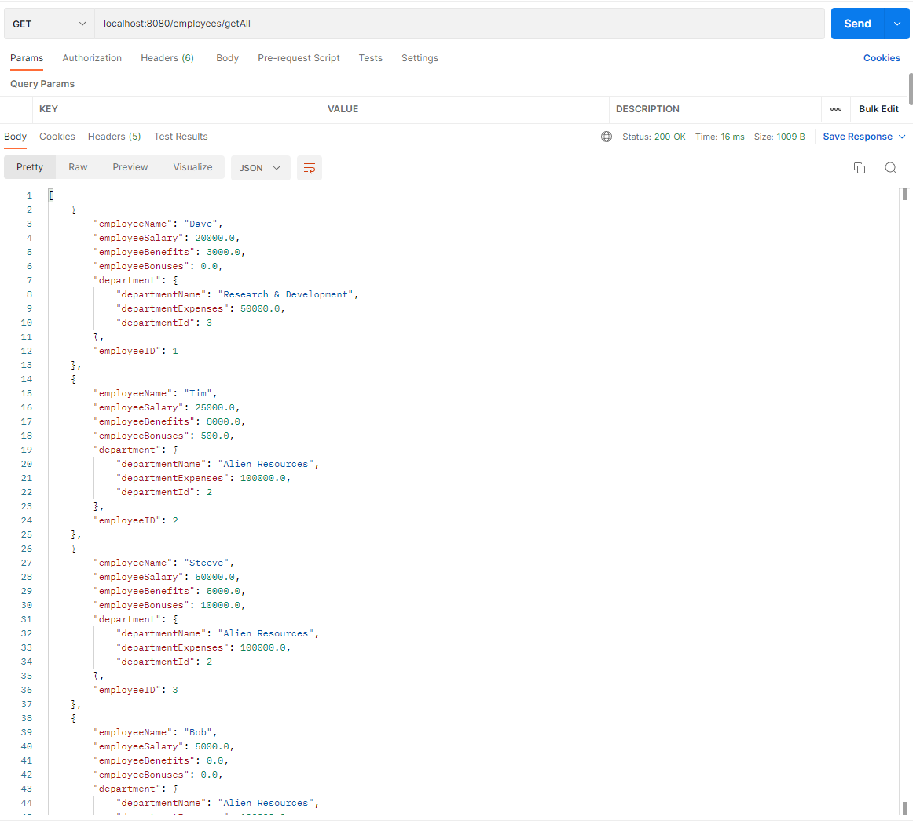

 

	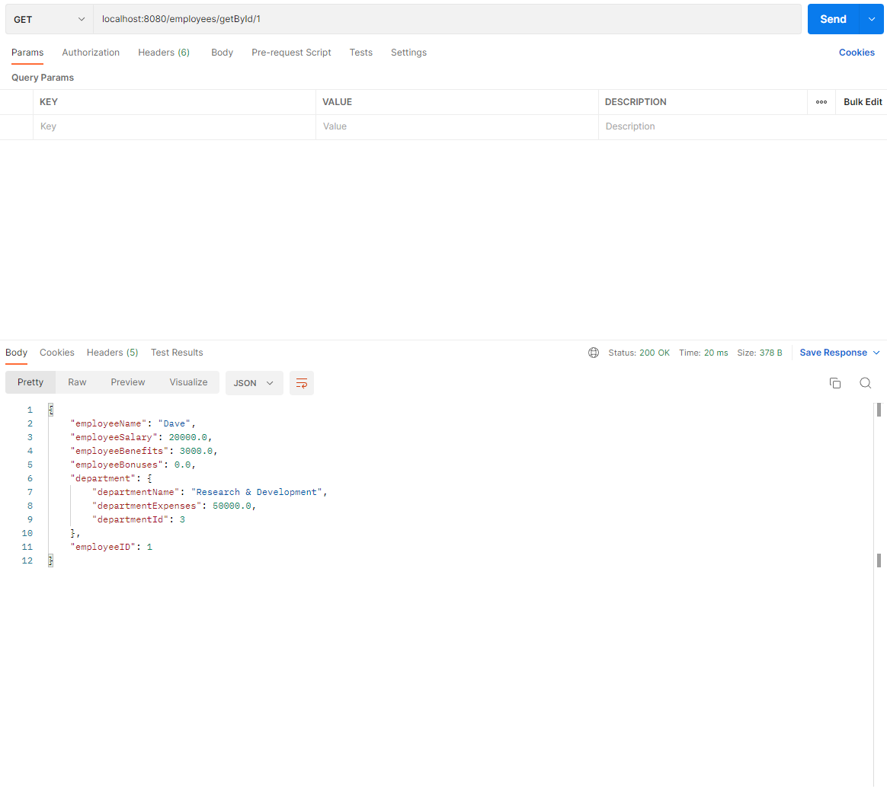

 

	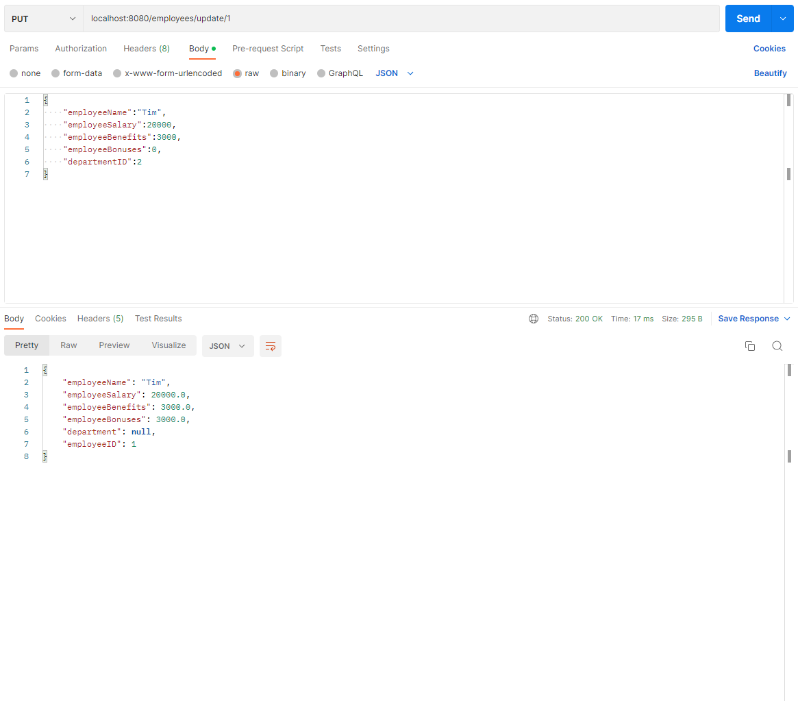

 

	

 

## Tests
Illustrated below are the results for the unit test of the department service.

	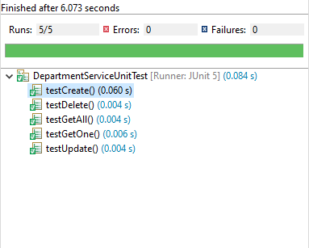

## Steps to run
Several requirements must be met for the application to run successfully:
1. As the application runs on port 8080, that port must not be in use.
2. A local instance of MySQL must exist on port 3306.
3. On that local instance of MySQL, the "root" user must exist and their password must be "pass".
4. Within that local instance of MySQL there must exist a database called "project".
6. The user must be running java version 8.
7. The user must run "AccountingSoftwareApplication.java" as a spring web app.
8. To access the functionality of the app, some kind of external application such as postman is necessary to make necessary inputs.

## What I learnt
This project taught me a lot about integrating the various parts of my QA java course. While none of the individual elements that made up my project were new to me remembering, combining and debugging them together really taught me the powerful possibilities available through the java platform. Alongside that, organising and presenting this project was an unexpected challange but one I now know that I can overcome with dilligence.
